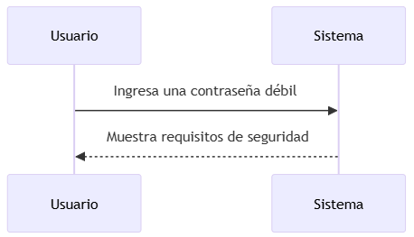
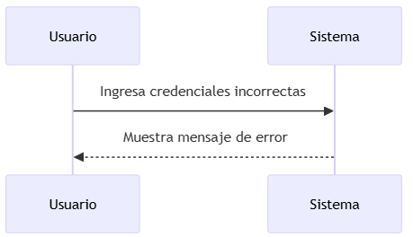
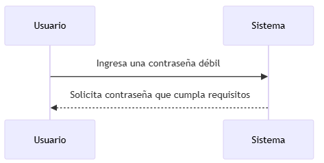
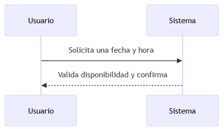
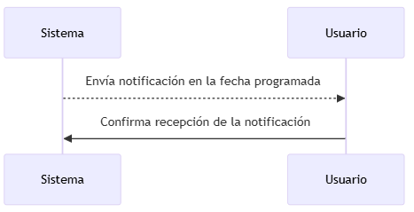
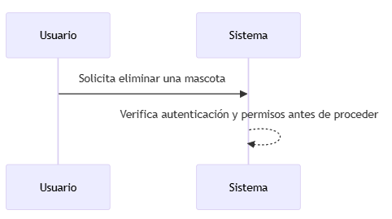
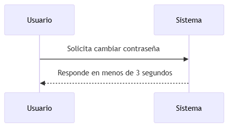
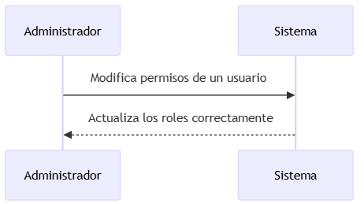
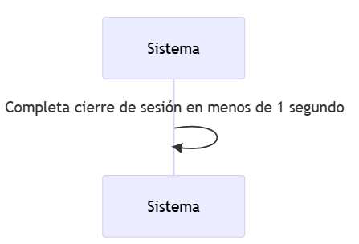
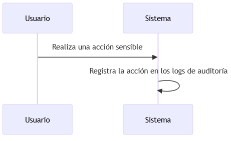

**Sistema Web de Gestión Veterinaria para Mascotas**
 
 **HU01: Registrar Usuario** 

**Diagrama de Caso de Uso** 

plantuml 

Copiar código 

@startuml 

actor Usuario 

Usuario --> (Registrar Usuario) 

(Registrar Usuario) --> (Validar Campos) 

(Registrar Usuario) --> (Verificar Duplicados) (Registrar Usuario) --> (Enviar Correo de Confirmación) @enduml 

**Diagramas de Secuencia** 

**CAF01: Validación de Campos Obligatorios** 

mermaid 

Copiar código 

sequenceDiagram 

participant Usuario 

participant Sistema 

Usuario ->> Sistema: Envía formulario con campos incompletos Sistema -->> Usuario: Muestra mensaje indicando los campos faltantes 

**CAF02: Verificación de Correo Electrónico** 

mermaid 

Copiar código 

sequenceDiagram 

participant Usuario 

participant Sistema 

Usuario ->> Sistema: Ingresa correo electrónico no válido Sistema -->> Usuario: Muestra mensaje de error 

**CAF03: Contraseña Segura** 

mermaid 

Copiar código 

sequenceDiagram 

participant Usuario 

participant Sistema 

Usuario ->> Sistema: Ingresa una contraseña débil Sistema -->> Usuario: Muestra requisitos de seguridad 

**CAF04: Verificación de Duplicados** 

mermaid 

Copiar código 

sequenceDiagram 

participant Usuario 

participant Sistema 

Usuario ->> Sistema: Intenta registrarse con un correo ya existente 

Sistema -->> Usuario: Muestra mensaje indicando duplicado 

**CAF05: Confirmación de Registro** 

mermaid 

Copiar código 

sequenceDiagram 

participant Usuario 

participant Sistema 

Usuario ->> Sistema: Completa formulario correctamente Sistema -->> Usuario: Envía correo de confirmación 

**CANF01: Seguridad de Contraseñas** 

mermaid 

Copiar código 

sequenceDiagram 

participant Sistema 

Sistema ->> Sistema: Cifra contraseñas utilizando bcrypt 

**CANF02: Tiempo de Respuesta** 

mermaid 

Copiar código 

sequenceDiagram 

participant Usuario 

participant Sistema 

Usuario ->> Sistema: Completa el registro 

Sistema -->> Usuario: Responde en menos de 3 segundos 

**HU02: Iniciar Sesión** 

**Diagrama de Caso de Uso** 

plantuml 

Copiar código 

@startuml 

actor Usuario 

Usuario --> (Iniciar Sesión) 

(Iniciar Sesión) --> (Validar Credenciales) 

(Iniciar Sesión) --> (Bloquear por Intentos Fallidos) @enduml 

**Diagramas de Secuencia** 

**CAF06: Validación de Credenciales** 

mermaid 

Copiar código 

sequenceDiagram 

participant Usuario 

participant Sistema 

Usuario ->> Sistema: Ingresa correo y contraseña válidos Sistema -->> Usuario: Permite acceso 

**CAF07: Manejo de Errores** 

mermaid 

Copiar código 

sequenceDiagram 

participant Usuario 

participant Sistema 

Usuario ->> Sistema: Ingresa credenciales incorrectas Sistema -->> Usuario: Muestra mensaje de error 

**CAF08: Bloqueo por Intentos Fallidos** 

mermaid 

Copiar código 

sequenceDiagram 

participant Usuario 

participant Sistema 

loop Hasta 5 intentos fallidos 

`    `Usuario ->> Sistema: Ingresa credenciales incorrectas     Sistema -->> Usuario: Muestra mensaje de error 

end 

Sistema -->> Usuario: Bloquea cuenta temporalmente 

**CAF09: Recordar Sesión** 

mermaid 

Copiar código 

sequenceDiagram 

participant Usuario 

participant Sistema 

Usuario ->> Sistema: Activa opción "Recordar sesión" Sistema -->> Usuario: Mantiene sesión abierta 

**CAF10: Cierre Automático por Inactividad** 

mermaid 

Copiar código sequenceDiagram participant Usuario participant Sistema 

Usuario ->> Sistema: Inactivo por más de 15 minutos Sistema -->> Usuario: Cierra sesión automáticamente 

**CANF03: Tiempo de Respuesta** 

mermaid 

Copiar código 

sequenceDiagram 

participant Usuario 

participant Sistema 

Usuario ->> Sistema: Solicita iniciar sesión 

Sistema -->> Usuario: Responde en menos de 2 segundos 

**CANF04: Seguridad de Sesión** 

mermaid 

Copiar código 

sequenceDiagram 

participant Sistema 

Sistema ->> Sistema: Genera token seguro con expiración 

**HU03: Recuperar Contraseña **

**Diagrama de Caso de Uso** 

plantuml 

Copiar código 

@startuml 

actor Usuario 

Usuario --> (Recuperar Contraseña) 

(Recuperar Contraseña) --> (Validar Correo Existente) (Recuperar Contraseña) --> (Enviar Código de Recuperación) @enduml 

**Diagramas de Secuencia** 

**CAF11: Solicitud de Recuperación** 

mermaid 

Copiar código 

sequenceDiagram 

participant Usuario 

participant Sistema 

Usuario ->> Sistema: Ingresa su correo 

Sistema -->> Usuario: Envía correo con instrucciones de recuperación 

**CAF12: Validación de Correo Existente** 

mermaid 

Copiar código 

sequenceDiagram 

participant Usuario 

participant Sistema 

Usuario ->> Sistema: Ingresa un correo no registrado Sistema -->> Usuario: Muestra mensaje de error 

**CAF13: Confirmación de Cambio** 

mermaid 

Copiar código sequenceDiagram participant Usuario 

participant Sistema 

Usuario ->> Sistema: Completa cambio de contraseña Sistema -->> Usuario: Muestra confirmación de éxito 

**CAF14: Contraseña Segura** 

mermaid 

Copiar código 

sequenceDiagram 

participant Usuario 

participant Sistema 

Usuario ->> Sistema: Ingresa una contraseña débil 

Sistema -->> Usuario: Solicita contraseña que cumpla requisitos 

**CAF15: Verificación de Código** 

mermaid 

Copiar código 

sequenceDiagram 

participant Usuario 

participant Sistema 

Usuario ->> Sistema: Ingresa el código de recuperación Sistema -->> Usuario: Valida y permite cambiar la contraseña 

**CANF05: Seguridad en el Proceso** 

mermaid 

Copiar código 

sequenceDiagram 

participant Sistema 

Sistema ->> Sistema: Expira códigos de recuperación tras 10 minutos 

**CANF06: Tiempo de Respuesta** 

mermaid 

Copiar código 

sequenceDiagram 

participant Usuario 

participant Sistema 

Usuario ->> Sistema: Solicita recuperación 

Sistema -->> Usuario: Responde en menos de 1 minuto 

**HU04: Actualizar Perfil** 

**Diagrama de Caso de Uso** 

plantuml 

Copiar código 

@startuml 

actor Usuario 

Usuario --> (Actualizar Perfil) 

(Actualizar Perfil) --> (Validar Datos) (Actualizar Perfil) --> (Guardar Cambios) (Actualizar Perfil) --> (Confirmar Actualización) @enduml 

**Diagramas de Secuencia** 

**CAF16: Validación de Datos** 

mermaid 

Copiar código sequenceDiagram 

participant Usuario 

participant Sistema 

Usuario ->> Sistema: Envía datos inválidos 

Sistema -->> Usuario: Retorna mensaje indicando los errores 

**CAF17: Confirmación de Cambios** 

mermaid 

Copiar código 

sequenceDiagram 

participant Usuario 

participant Sistema 

Usuario ->> Sistema: Realiza cambios en su perfil 

Sistema -->> Usuario: Confirma que los cambios fueron exitosos 

**CAF18: Verificación de Correo** 

mermaid 

Copiar código 

sequenceDiagram 

participant Usuario 

participant Sistema 

Usuario ->> Sistema: Cambia su correo electrónico Sistema -->> Usuario: Envía correo de verificación 

**CAF19: Reversión de Cambios** 

mermaid 

Copiar código 

sequenceDiagram 

participant Usuario 

participant Sistema 

Usuario ->> Sistema: Solicita revertir cambios en su perfil Sistema -->> Usuario: Reversa los cambios y confirma la acción 

**CAF20: Actualización de Foto de Perfil** 

mermaid 

Copiar código 

sequenceDiagram 

participant Usuario 

participant Sistema 

Usuario ->> Sistema: Sube una nueva foto de perfil Sistema -->> Usuario: Guarda la nueva imagen correctamente 

**CANF07: Compatibilidad** 

mermaid 

Copiar código 

sequenceDiagram 

participant Usuario 

participant Sistema 

Usuario ->> Sistema: Accede desde diferentes navegadores 

Sistema -->> Usuario: Funciona correctamente en Chrome, Firefox y Edge 

**CANF08: Tiempo de Respuesta** 

mermaid 

Copiar código 

sequenceDiagram 

participant Usuario 

participant Sistema 

Usuario ->> Sistema: Realiza actualizaciones en su perfil Sistema -->> Usuario: Responde en menos de 3 segundos 

**HU05: Agregar Mascota ![ref1]**

**Diagrama de Caso de Uso** 

plantuml 

Copiar código 

@startuml 

actor Usuario 

Usuario --> (Agregar Mascota) 

(Agregar Mascota) --> (Validar Campos Obligatorios) (Agregar Mascota) --> (Registrar Mascota) 

(Agregar Mascota) --> (Confirmar Registro) 

@enduml 

**Diagramas de Secuencia** 

**CAF21: Validación de Campos Obligatorios** 

mermaid 

Copiar código 

sequenceDiagram 

participant Usuario 

participant Sistema 

Usuario ->> Sistema: Ingresa datos incompletos 

Sistema -->> Usuario: Muestra mensaje indicando los campos faltantes 

**CAF22: Registro Exitoso** 

mermaid 

Copiar código 

sequenceDiagram 

participant Usuario 

participant Sistema 

Usuario ->> Sistema: Completa el formulario correctamente Sistema -->> Usuario: Registra la mascota y confirma el éxito 

**CAF23: Selección de Especie y Raza** 

mermaid 

Copiar código 

sequenceDiagram 

participant Usuario 

participant Sistema 

Usuario ->> Sistema: Selecciona una especie Sistema -->> Usuario: Muestra las razas disponibles 

**CAF24: Validación de Fecha de Nacimiento** 

mermaid 

Copiar código 

sequenceDiagram 

participant Usuario 

participant Sistema 

Usuario ->> Sistema: Ingresa una fecha de nacimiento inválida Sistema -->> Usuario: Muestra mensaje de error 

**CAF25: Confirmación de Registro** 

mermaid 

Copiar código 

sequenceDiagram 

participant Usuario 

participant Sistema 

Usuario ->> Sistema: Agrega una mascota correctamente Sistema -->> Usuario: Muestra mensaje confirmando el registro 

**CANF09: Seguridad de Datos** 

mermaid 

Copiar código 

sequenceDiagram 

participant Sistema 

Sistema ->> Sistema: Cifra los datos sensibles de la mascota 

**CANF10: Tiempo de Respuesta** 

mermaid 

Copiar código 

sequenceDiagram 

participant Usuario 

participant Sistema 

Usuario ->> Sistema: Completa el registro de la mascota Sistema -->> Usuario: Responde en menos de 3 segundos 

**HU06: Programar Citas ![ref1]**

**Diagrama de Caso de Uso** 

plantuml 

Copiar código 

@startuml 

actor Usuario 

Usuario --> (Programar Citas) 

(Programar Citas) --> (Seleccionar Fecha y Hora) (Programar Citas) --> (Confirmar Cita) (Programar Citas) --> (Notificar Veterinario) @enduml 

**Diagramas de Secuencia** 

**CAF26: Selección de Fecha y Hora** 

mermaid 

Copiar código sequenceDiagram participant Usuario participant Sistema 

Usuario ->> Sistema: Solicita una fecha y hora Sistema -->> Usuario: Valida disponibilidad y confirma 

**CAF27: Confirmación de Cita** 

mermaid 

Copiar código 

sequenceDiagram 

participant Usuario 

participant Sistema 

Usuario ->> Sistema: Completa la programación de la cita Sistema -->> Usuario: Confirma y envía notificación. 

**CAF28: Visualización de Citas Programadas** 

mermaid 

Copiar código 

sequenceDiagram 

participant Usuario 

participant Sistema 

Usuario ->> Sistema: Solicita ver citas programadas Sistema -->> Usuario: Muestra las citas futuras 

**CAF29: Cancelación de Cita** 

mermaid 

Copiar código 

sequenceDiagram 

participant Usuario 

participant Sistema 

Usuario ->> Sistema: Solicita cancelar una cita 

Sistema -->> Usuario: Cancela la cita y envía notificación al veterinario 

**CAF30: Modificación de Cita** 

mermaid 

Copiar código 

sequenceDiagram 

participant Usuario 

participant Sistema 

Usuario ->> Sistema: Solicita modificar fecha y hora Sistema -->> Usuario: Valida y actualiza la cita 

**CANF11: Escalabilidad** 

mermaid 

Copiar código 

sequenceDiagram 

participant Sistema 

Sistema ->> Sistema: Maneja múltiples usuarios programando citas simultáneamente 

**CANF12: Tiempo de Respuesta** 

mermaid 

Copiar código 

sequenceDiagram 

participant Usuario 

participant Sistema 

Usuario ->> Sistema: Completa la programación de citas Sistema -->> Usuario: Responde en menos de 5 segundos 

**HU07: Notificaciones de Vacunas** 

**Diagrama de Caso de Uso** 

plantuml 

Copiar código 

@startuml 

actor Usuario 

Usuario --> (Notificaciones de Vacunas) 

(Notificaciones de Vacunas) --> (Registrar Fechas de Vacunación) (Notificaciones de Vacunas) --> (Configurar Recordatorios) (Notificaciones de Vacunas) --> (Enviar Notificaciones Automáticas) @enduml 

**Diagramas de Secuencia** 

**CAF31: Registro de Vacunas** 

mermaid 

Copiar código 

sequenceDiagram 

participant Usuario 

participant Sistema 

Usuario ->> Sistema: Registra una vacuna con fecha 

Sistema -->> Usuario: Programa la notificación correspondiente 

**CAF32: Personalización de Notificaciones** 

mermaid 

Copiar código 

sequenceDiagram 

participant Usuario 

participant Sistema 

Usuario ->> Sistema: Configura tiempo de aviso antes de vacuna Sistema -->> Usuario: Guarda configuración personalizada 

**CAF33: Notificación Automática** 

mermaid 

Copiar código 

sequenceDiagram 

participant Sistema 

participant Usuario 

Sistema -->> Usuario: Envía notificación en la fecha programada Usuario ->> Sistema: Confirma recepción de la notificación 

**CAF34: Confirmación de Recepción** 

mermaid 

Copiar código 

sequenceDiagram 

participant Usuario 

participant Sistema 

Sistema -->> Usuario: Envía notificación 

Usuario ->> Sistema: Confirma recepción de la notificación 

**CAF35: Cancelación de Notificaciones** 

mermaid 

Copiar código 

sequenceDiagram 

participant Usuario 

participant Sistema 

Usuario ->> Sistema: Elimina una vacuna registrada Sistema -->> Usuario: Cancela notificaciones asociadas 

**CANF13: Disponibilidad** 

mermaid 

Copiar código 

sequenceDiagram 

participant Usuario 

participant Sistema 

Usuario ->> Sistema: Configura recordatorio 

Sistema -->> Usuario: Garantiza disponibilidad del 99.9% anual 

**CANF14: Frecuencia de Envío** 

mermaid 

Copiar código 

sequenceDiagram 

participant Sistema 

Sistema ->> Sistema: Envía notificaciones con una tasa máxima de 2 por segundo 

**HU08: Historial Médico de Mascota ![ref1]**

**Diagrama de Caso de Uso** 

plantuml 

Copiar código 

@startuml 

actor Usuario 

Usuario --> (Historial Médico de Mascota) 

(Historial Médico de Mascota) --> (Registrar Consultas) (Historial Médico de Mascota) --> (Visualizar Historial Completo) (Historial Médico de Mascota) --> (Exportar Historial) 

@enduml 

**Diagramas de Secuencia** 

**CAF36: Visualización de Historial Completo** 

mermaid 

Copiar código sequenceDiagram participant Usuario participant Sistema 

Usuario ->> Sistema: Solicita historial médico Sistema -->> Usuario: Muestra el historial completo 

**CAF37: Registro de Consultas** 

mermaid 

Copiar código 

sequenceDiagram 

participant Usuario 

participant Sistema 

Usuario ->> Sistema: Ingresa detalles de una consulta médica Sistema -->> Usuario: Guarda consulta en el historial 

**CAF38: Filtros de Búsqueda** 

mermaid 

Copiar código 

sequenceDiagram 

participant Usuario 

participant Sistema 

Usuario ->> Sistema: Aplica filtro por fecha y tipo de evento Sistema -->> Usuario: Muestra eventos relevantes según filtro 

**CAF39: Exportación del Historial** 

mermaid 

Copiar código 

sequenceDiagram 

participant Usuario 

participant Sistema 

Usuario ->> Sistema: Solicita exportar historial 

Sistema -->> Usuario: Genera archivo en formato PDF o Excel 

**CAF40: Edición de Eventos** 

mermaid 

Copiar código 

sequenceDiagram 

participant Usuario 

participant Sistema 

Usuario ->> Sistema: Solicita editar detalles de un evento Sistema -->> Usuario: Permite edición y guarda cambios 

**CANF15: Escalabilidad** 

mermaid 

Copiar código 

sequenceDiagram 

participant Sistema 

Sistema ->> Sistema: Maneja hasta 1,000 registros por mascota sin degradación 

**CANF16: Seguridad de Datos** 

mermaid 

Copiar código 

sequenceDiagram 

participant Sistema 

Sistema ->> Sistema: Cifra datos del historial en tránsito y reposo 

**HU09: Agregar Veterinarias **

**Diagrama de Caso de Uso** 

plantuml 

Copiar código 

@startuml 

actor Usuario 

Usuario --> (Agregar Veterinarias) 

(Agregar Veterinarias) --> (Buscar Veterinarias) 

(Agregar Veterinarias) --> (Registrar Veterinarias en Lista) (Agregar Veterinarias) --> (Visualizar Detalles de Veterinarias) @enduml 

**Diagramas de Secuencia** 

**CAF41: Búsqueda de Veterinarias** 

mermaid Copiar código sequenceDiagram 

participant Usuario 

participant Sistema 

Usuario ->> Sistema: Busca veterinarias por nombre o ubicación Sistema -->> Usuario: Muestra resultados relevantes 

**CAF42: Agregar Veterinaria** 

mermaid 

Copiar código 

sequenceDiagram 

participant Usuario 

participant Sistema 

Usuario ->> Sistema: Selecciona una veterinaria 

Sistema -->> Usuario: Agrega veterinaria a su lista y confirma 

**CAF43: Gestión de Veterinarias** 

mermaid 

Copiar código 

sequenceDiagram 

participant Usuario 

participant Sistema 

Usuario ->> Sistema: Solicita eliminar veterinaria de su lista Sistema -->> Usuario: Elimina y confirma eliminación 

**CAF44: Visualización de Detalles** 

mermaid 

Copiar código 

sequenceDiagram 

participant Usuario 

participant Sistema 

Usuario ->> Sistema: Solicita detalles de una veterinaria Sistema -->> Usuario: Muestra información completa 

**CAF45: Geolocalización** 

mermaid 

Copiar código 

sequenceDiagram 

participant Usuario 

participant Sistema 

Usuario ->> Sistema: Solicita ubicación de la veterinaria Sistema -->> Usuario: Muestra mapa con geolocalización 

**CANF17: Tiempo de Respuesta** 

mermaid 

Copiar código 

sequenceDiagram 

participant Usuario 

participant Sistema 

Usuario ->> Sistema: Realiza búsqueda de veterinarias Sistema -->> Usuario: Responde en menos de 3 segundos 

**CANF18: Compatibilidad** 

mermaid 

Copiar código 

sequenceDiagram 

participant Usuario 

participant Sistema 

Usuario ->> Sistema: Accede desde un dispositivo móvil 

Sistema -->> Usuario: Funciona correctamente en dispositivos móviles 

**HU10: Directorio de Farmacias** 

**Diagrama de Caso de Uso** 

plantuml 

Copiar código 

@startuml 

actor Usuario 

Usuario --> (Consultar Directorio de Farmacias) 

(Consultar Directorio de Farmacias) --> (Buscar Farmacias) 

(Consultar Directorio de Farmacias) --> (Ver Medicamentos Disponibles) (Consultar Directorio de Farmacias) --> (Agregar Farmacia a Favoritos) @enduml 

**Diagramas de Secuencia** 

**CAF46: Búsqueda de Farmacias** 

mermaid 

Copiar código 

sequenceDiagram 

participant Usuario 

participant Sistema 

Usuario ->> Sistema: Busca farmacias por ubicación o nombre Sistema -->> Usuario: Muestra resultados relevantes 

**CAF47: Visualización de Medicamentos** 

mermaid 

Copiar código 

sequenceDiagram 

participant Usuario 

participant Sistema 

Usuario ->> Sistema: Solicita lista de medicamentos de una farmacia Sistema -->> Usuario: Muestra los medicamentos disponibles 

**CAF48: Agregar a Favoritos** 

mermaid 

Copiar código 

sequenceDiagram 

participant Usuario 

participant Sistema 

Usuario ->> Sistema: Marca farmacia como favorita 

Sistema -->> Usuario: Agrega farmacia a la lista de favoritos 

**CAF49: Filtrar por Servicios** 

mermaid 

Copiar código 

sequenceDiagram 

participant Usuario 

participant Sistema 

Usuario ->> Sistema: Aplica filtros de servicios en el directorio Sistema -->> Usuario: Muestra farmacias que cumplen los criterios 

**CAF50: Contacto Directo** 

mermaid 

Copiar código 

sequenceDiagram 

participant Usuario 

participant Sistema 

Usuario ->> Sistema: Solicita información de contacto de una farmacia Sistema -->> Usuario: Muestra teléfono y correo de la farmacia 

**CANF19: Escalabilidad** 

mermaid 

Copiar código 

sequenceDiagram 

participant Sistema 

Sistema ->> Sistema: Maneja hasta 500 farmacias registradas sin degradación 

**CANF20: Disponibilidad** 

mermaid 

Copiar código 

sequenceDiagram 

participant Usuario 

participant Sistema 

Usuario ->> Sistema: Accede al directorio de farmacias Sistema -->> Usuario: Asegura disponibilidad del 99.9% 

**HU11: Reportes Personalizados ![ref1]**

**Diagrama de Caso de Uso** 

plantuml 

Copiar código 

@startuml 

actor Usuario 

Usuario --> (Generar Reportes Personalizados) 

(Generar Reportes Personalizados) --> (Configurar Filtros) (Generar Reportes Personalizados) --> (Descargar Reporte) (Generar Reportes Personalizados) --> (Compartir Reporte) @enduml 

**Diagramas de Secuencia** 

**CAF51: Generación de Reportes** 

mermaid Copiar código sequenceDiagram 

participant Usuario 

participant Sistema 

Usuario ->> Sistema: Solicita generar reporte 

Sistema -->> Usuario: Proporciona el reporte solicitado 

**CAF52: Filtros Personalizados** 

mermaid 

Copiar código 

sequenceDiagram 

participant Usuario 

participant Sistema 

Usuario ->> Sistema: Aplica filtros específicos para el reporte Sistema -->> Usuario: Genera reporte basado en los filtros 

**CAF53: Descarga de Reportes** 

mermaid 

Copiar código 

sequenceDiagram 

participant Usuario 

participant Sistema 

Usuario ->> Sistema: Solicita descargar un reporte 

Sistema -->> Usuario: Proporciona archivo en formato PDF o Excel 

**CAF54: Visualización de Resumen** 

mermaid 

Copiar código 

sequenceDiagram 

participant Usuario 

participant Sistema 

Usuario ->> Sistema: Solicita resumen general 

Sistema -->> Usuario: Muestra gráfico interactivo con datos principales 

**CAF55: Compartir Reportes** 

mermaid 

Copiar código 

sequenceDiagram 

participant Usuario 

participant Sistema 

Usuario ->> Sistema: Solicita compartir reporte por correo Sistema -->> Usuario: Envía reporte al correo indicado 

**CANF21: Tiempo de Respuesta** 

mermaid 

Copiar código 

sequenceDiagram 

participant Usuario 

participant Sistema 

Usuario ->> Sistema: Solicita generar reporte Sistema -->> Usuario: Responde en menos de 5 segundos 

**CANF22: Seguridad de Datos** 

mermaid 

Copiar código 

sequenceDiagram 

participant Sistema 

Sistema ->> Sistema: Protege reportes contra accesos no autorizados 

**HU12: Eliminar Mascota **

**Diagrama de Caso de Uso** 

plantuml 

Copiar código 

@startuml 

actor Usuario 

Usuario --> (Eliminar Mascota) 

(Eliminar Mascota) --> (Confirmar Eliminación) 

(Eliminar Mascota) --> (Validar Permisos) 

(Eliminar Mascota) --> (Cancelar Notificaciones Asociadas) @enduml 

**Diagramas de Secuencia** 

**CAF56: Confirmación de Eliminación** mermaid 

Copiar código 

sequenceDiagram 

participant Usuario 

participant Sistema 

Usuario ->> Sistema: Solicita eliminar una mascota Sistema -->> Usuario: Solicita confirmación de eliminación 

**CAF57: Validación de Permisos** 

mermaid 

Copiar código 

sequenceDiagram 

participant Usuario 

participant Sistema 

Usuario ->> Sistema: Intenta eliminar una mascota 

Sistema -->> Usuario: Valida que sea el propietario de la cuenta 

**CAF58: Eliminación Exitosa** 

mermaid 

Copiar código 

sequenceDiagram 

participant Usuario 

participant Sistema 

Usuario ->> Sistema: Confirma la eliminación Sistema -->> Usuario: Elimina mascota del sistema 

**CAF59: Cancelación de Notificaciones** 

mermaid 

Copiar código 

sequenceDiagram 

participant Usuario 

participant Sistema 

Usuario ->> Sistema: Solicita eliminar mascota con notificaciones pendientes 

Sistema -->> Usuario: Cancela todas las notificaciones asociadas 

**CAF60: Historial Asociado** 

mermaid 

Copiar código 

sequenceDiagram 

participant Usuario 

participant Sistema 

Usuario ->> Sistema: Intenta acceder al historial de una mascota eliminada 

Sistema -->> Usuario: Informa que la mascota ya no está disponible 

**CANF23: Persistencia** 

mermaid 

Copiar código 

sequenceDiagram 

participant Sistema 

Sistema ->> Sistema: Elimina datos de la mascota de la base de datos en menos de 3 segundos 

**CANF24: Seguridad de Permisos** 

mermaid 

Copiar código 

sequenceDiagram 

participant Usuario 

participant Sistema 

Usuario ->> Sistema: Solicita eliminar una mascota 

Sistema -->> Sistema: Verifica autenticación y permisos antes de proceder 

**HU13: Cambiar Contraseña** 

**Diagrama de Caso de Uso** 

plantuml 

Copiar código 

@startuml 

actor Usuario 

Usuario --> (Cambiar Contraseña) 

(Cambiar Contraseña) --> (Validar Contraseña Actual) (Cambiar Contraseña) --> (Ingresar Nueva Contraseña) (Cambiar Contraseña) --> (Confirmar Cambio) 

@enduml 

**Diagramas de Secuencia** 

**CAF61: Validación de Contraseña Actual** 

mermaid 

Copiar código sequenceDiagram participant Usuario participant Sistema 

Usuario ->> Sistema: Ingresa contraseña actual incorrecta Sistema -->> Usuario: Muestra mensaje de error 

**CAF62: Validación de Nueva Contraseña** 

mermaid 

Copiar código 

sequenceDiagram 

participant Usuario 

participant Sistema 

Usuario ->> Sistema: Ingresa nueva contraseña que no cumple requisitos Sistema -->> Usuario: Solicita contraseña válida 

**CAF63: Confirmación de Cambio** 

mermaid 

Copiar código 

sequenceDiagram 

participant Usuario 

participant Sistema 

Usuario ->> Sistema: Completa cambio de contraseña Sistema -->> Usuario: Confirma el cambio exitoso 

**CAF64: Notificación de Cambio** 

mermaid 

Copiar código 

sequenceDiagram 

participant Sistema 

participant Usuario 

Sistema -->> Usuario: Envía correo notificando el cambio de contraseña 

**CAF65: Expiración de Sesiones** 

mermaid 

Copiar código 

sequenceDiagram 

participant Usuario 

participant Sistema 

Usuario ->> Sistema: Cambia su contraseña 

Sistema -->> Usuario: Cierra todas las sesiones activas 

**CANF25: Seguridad de Contraseñas** 

mermaid 

Copiar código 

sequenceDiagram 

participant Sistema 

Sistema ->> Sistema: Almacena contraseñas cifradas con bcrypt 

**CANF26: Tiempo de Respuesta** 

mermaid 

Copiar código 

sequenceDiagram 

participant Usuario 

participant Sistema 

Usuario ->> Sistema: Solicita cambiar contraseña Sistema -->> Usuario: Responde en menos de 3 segundos 

**HU14: Rol de Administrador ![ref1]**

**Diagrama de Caso de Uso** 

plantuml 

Copiar código 

@startuml 

actor Administrador 

Administrador --> (Gestionar Usuarios) Administrador --> (Gestionar Veterinarias) Administrador --> (Visualizar Reportes) Administrador --> (Configurar Roles) @enduml 

**Diagramas de Secuencia** 

**CAF66: Gestión de Usuarios** 

mermaid 

Copiar código 

sequenceDiagram 

participant Administrador 

participant Sistema 

Administrador ->> Sistema: Solicita acceso al panel de usuarios Sistema -->> Administrador: Muestra lista de usuarios Administrador ->> Sistema: Edita o elimina un usuario 

Sistema -->> Administrador: Confirma los cambios 

**CAF67: Gestión de Veterinarias** 

mermaid 

Copiar código 

sequenceDiagram 

participant Administrador 

participant Sistema 

Administrador ->> Sistema: Accede al panel de veterinarias Sistema -->> Administrador: Permite agregar, editar o eliminar veterinarias 

**CAF68: Visualización de Reportes** 

mermaid 

Copiar código 

sequenceDiagram 

participant Administrador 

participant Sistema 

Administrador ->> Sistema: Genera un reporte del sistema Sistema -->> Administrador: Proporciona reporte solicitado 

**CAF69: Configuración de Roles** 

mermaid 

Copiar código 

sequenceDiagram 

participant Administrador 

participant Sistema 

Administrador ->> Sistema: Modifica permisos de un usuario Sistema -->> Administrador: Actualiza los roles correctamente 

**CAF70: Auditoría de Actividades** 

mermaid 

Copiar código 

sequenceDiagram 

participant Administrador 

participant Sistema 

Administrador ->> Sistema: Realiza cambios críticos en el sistema Sistema -->> Administrador: Registra las acciones para auditoría 

**CANF27: Escalabilidad** 

mermaid 

Copiar código 

sequenceDiagram 

participant Sistema 

Sistema ->> Sistema: Soporta hasta 1,000 administradores concurrentes 

**CANF28: Seguridad de Roles** 

mermaid 

Copiar código 

sequenceDiagram 

participant Administrador 

participant Sistema 

Administrador ->> Sistema: Solicita acceso a funciones críticas Sistema -->> Administrador: Solicita autenticación de dos factores (2FA) 

**HU15: Soporte Técnico **

**Diagrama de Caso de Uso** 

plantuml 

Copiar código 

@startuml 

actor Usuario 

Usuario --> (Contactar Soporte Técnico) 

(Contactar Soporte Técnico) --> (Completar Formulario) (Contactar Soporte Técnico) --> (Generar Ticket de Soporte) (Contactar Soporte Técnico) --> (Visualizar Estado del Ticket) @enduml 

**Diagramas de Secuencia** 

**CAF71: Solicitud de Ayuda** 

mermaid 

Copiar código 

sequenceDiagram 

participant Usuario 

participant Sistema 

Usuario ->> Sistema: Completa formulario de soporte Sistema -->> Usuario: Confirma generación de ticket 

**CAF72: Respuesta Automática** 

mermaid 

Copiar código 

sequenceDiagram 

participant Usuario 

participant Sistema 

Usuario ->> Sistema: Envía solicitud de soporte 

Sistema -->> Usuario: Genera ticket y envía respuesta automática 

**CAF73: Visualización del Estado del Ticket** 

mermaid 

Copiar código 

sequenceDiagram 

participant Usuario 

participant Sistema 

Usuario ->> Sistema: Consulta estado del ticket Sistema -->> Usuario: Muestra progreso del ticket 

**CAF74: Prioridad de Casos** 

mermaid 

Copiar código 

sequenceDiagram 

participant Usuario 

participant Sistema 

Usuario ->> Sistema: Describe problema urgente Sistema -->> Usuario: Asigna prioridad alta al caso 

**CAF75: Escalamiento de Problemas** 

mermaid 

Copiar código 

sequenceDiagram 

participant Usuario 

participant Sistema 

Usuario ->> Sistema: Reporta problema no resuelto Sistema -->> Usuario: Escala el caso a nivel superior 

**CANF29: Tiempo de Respuesta Inicial** 

mermaid 

Copiar código 

sequenceDiagram 

participant Usuario 

participant Sistema 

Usuario ->> Sistema: Envía solicitud de soporte Sistema -->> Usuario: Responde en menos de 1 minuto 

**CANF30: Disponibilidad** 

mermaid 

Copiar código 

sequenceDiagram 

participant Usuario 

participant Sistema 

Usuario ->> Sistema: Accede al módulo de soporte 

Sistema -->> Usuario: Garantiza disponibilidad 24/7 con 99.9% de uptime 

**HU16: Cierre de Sesión Automático** 

**Diagrama de Caso de Uso** 

plantuml 

Copiar código 

@startuml 

actor Usuario 

Usuario --> (Cierre de Sesión Automático) 

(Cierre de Sesión Automático) --> (Detectar Inactividad) (Cierre de Sesión Automático) --> (Notificar al Usuario) (Cierre de Sesión Automático) --> (Cerrar Sesión) @enduml 

**Diagramas de Secuencia** 

**CAF76: Detección de Inactividad** 

mermaid 

Copiar código 

sequenceDiagram 

participant Usuario 

participant Sistema 

Usuario ->> Sistema: No realiza actividad por más de 15 minutos 

Sistema -->> Usuario: Detecta inactividad 

**CAF77: Notificación de Cierre** 

mermaid 

Copiar código 

sequenceDiagram 

participant Sistema 

participant Usuario 

Sistema -->> Usuario: Envía notificación de cierre inminente Usuario ->> Sistema: Responde para mantener sesión activa (opcional) 

**CAF78: Cierre Seguro** 

mermaid 

Copiar código 

sequenceDiagram 

participant Sistema 

Sistema ->> Sistema: Invalida token de sesión y cierra sesión del usuario 

**CAF79: Persistencia de Datos** 

mermaid 

Copiar código 

sequenceDiagram 

participant Usuario 

participant Sistema 

Usuario ->> Sistema: Cierra sesión automáticamente 

Sistema -->> Usuario: Guarda cambios no enviados antes de cerrar sesión 

**CAF80: Reautenticación** 

mermaid 

Copiar código 

sequenceDiagram 

participant Usuario 

participant Sistema 

Usuario ->> Sistema: Intenta acceder después del cierre automático Sistema -->> Usuario: Solicita credenciales nuevamente 

**CANF31: Tiempo de Respuesta** 

mermaid 

Copiar código 

sequenceDiagram 

participant Sistema 

Sistema ->> Sistema: Completa cierre de sesión en menos de 1 segundo 

**CANF32: Seguridad** 

mermaid 

Copiar código 

sequenceDiagram 

participant Sistema 

Sistema ->> Sistema: Invalida todos los tokens activos asociados al usuario 

**HU17: Visualización en Móviles **

**Diagrama de Caso de Uso** 

plantuml 

Copiar código 

@startuml 

actor Usuario 

Usuario --> (Visualización en Móviles) 

(Visualización en Móviles) --> (Adaptación Responsiva) (Visualización en Móviles) --> (Compatibilidad con Navegadores) (Visualización en Móviles) --> (Optimización de Recursos) @enduml 

**Diagramas de Secuencia** 

**CAF81: Diseño Responsivo** 

mermaid 

Copiar código sequenceDiagram participant Usuario participant Sistema 

Usuario ->> Sistema: Accede desde un dispositivo móvil 

Sistema -->> Usuario: Adapta diseño a la pantalla del dispositivo 

**CAF82: Navegación Intuitiva** 

mermaid 

Copiar código 

sequenceDiagram 

participant Usuario 

participant Sistema 

Usuario ->> Sistema: Interactúa con la interfaz móvil 

Sistema -->> Usuario: Proporciona una experiencia fluida y clara 

**CAF83: Acceso a Funcionalidades Principales** 

mermaid 

Copiar código 

sequenceDiagram 

participant Usuario 

participant Sistema 

Usuario ->> Sistema: Solicita funcionalidades desde móvil Sistema -->> Usuario: Habilita acceso a todas las funciones principales 

**CAF84: Optimización de Imágenes** 

mermaid 

Copiar código 

sequenceDiagram 

participant Usuario 

participant Sistema 

Usuario ->> Sistema: Solicita recursos gráficos desde móvil Sistema -->> Usuario: Carga imágenes optimizadas para dispositivos móviles 

**CAF85: Notificaciones Push** 

mermaid 

Copiar código 

sequenceDiagram 

participant Usuario 

participant Sistema 

Usuario ->> Sistema: Habilita notificaciones push en el móvil Sistema -->> Usuario: Envia notificaciones programadas 

**CANF33: Compatibilidad** 

mermaid 

Copiar código 

sequenceDiagram 

participant Usuario 

participant Sistema 

Usuario ->> Sistema: Accede desde navegadores móviles Sistema -->> Usuario: Funciona correctamente en Android e iOS 

**CANF34: Tiempo de Respuesta** 

mermaid 

Copiar código 

sequenceDiagram 

participant Usuario 

participant Sistema 

Usuario ->> Sistema: Solicita acceso desde móvil Sistema -->> Usuario: Carga en menos de 3 segundos 

**HU18: Seguridad de Datos **

**Diagrama de Caso de Uso** 

plantuml 

Copiar código 

@startuml 

actor Usuario 

Usuario --> (Seguridad de Datos) 

(Seguridad de Datos) --> (Encriptación de Datos) (Seguridad de Datos) --> (Autenticación de Usuario) (Seguridad de Datos) --> (Registro de Actividades) @enduml 

**Diagramas de Secuencia** 

**CAF86: Encriptación de Datos** 

mermaid 

Copiar código 

sequenceDiagram 

participant Usuario 

participant Sistema 

Usuario ->> Sistema: Ingresa datos sensibles 

Sistema ->> Sistema: Cifra datos antes de almacenarlos Sistema -->> Usuario: Confirma que los datos están protegidos 

**CAF87: Autenticación de Usuario** 

mermaid 

Copiar código 

sequenceDiagram 

participant Usuario 

participant Sistema 

Usuario ->> Sistema: Solicita acceso 

Sistema -->> Usuario: Valida credenciales y permite acceso 

**CAF88: Protección de Sesiones** 

mermaid 

Copiar código 

sequenceDiagram 

participant Usuario 

participant Sistema 

Usuario ->> Sistema: Inicia sesión 

Sistema ->> Sistema: Genera token seguro para autenticación Sistema -->> Usuario: Permite acceso al sistema 

**CAF89: Registro de Actividades** 

mermaid 

Copiar código 

sequenceDiagram 

participant Usuario 

participant Sistema 

Usuario ->> Sistema: Realiza una acción sensible 

Sistema ->> Sistema: Registra la acción en los logs de auditoría 

**CAF90: Manejo de Errores de Seguridad** 

mermaid 

Copiar código 

sequenceDiagram 

participant Usuario 

participant Sistema 

Usuario ->> Sistema: Intenta acceso no autorizado 

Sistema ->> Sistema: Bloquea intento y registra actividad Sistema -->> Usuario: Notifica intento fallido 

**CANF35: Cifrado de Datos** 

mermaid 

Copiar código 

sequenceDiagram 

participant Sistema 

Sistema ->> Sistema: Cifra todos los datos sensibles en tránsito y reposo 

**CANF36: Tiempo de Respuesta** 

mermaid 

Copiar código sequenceDiagram 

participant Usuario participant Sistema 

Usuario ->> Sistema: Solicita autenticación Sistema -->> Usuario: Valida en menos de 2 segundos 

**HU19: Tiempo de Respuesta Rápido** 

**Diagrama de Caso de Uso** 

plantuml 

Copiar código 

@startuml 

actor Usuario 

Usuario --> (Tiempo de Respuesta Rápido) 

(Tiempo de Respuesta Rápido) --> (Optimización de Consultas) (Tiempo de Respuesta Rápido) --> (Caché de Recursos) 

(Tiempo de Respuesta Rápido) --> (Reducción de Tamaño de Archivos) @enduml 

**Diagramas de Secuencia** 

**CAF91: Optimización de Consultas** 

mermaid 

Copiar código sequenceDiagram 

Usuario ->> Sistema: Solicita datos desde una página Sistema ->> Sistema: Optimiza consultas en la base de datos Sistema -->> Usuario: Responde con datos rápidamente 

**CAF92: Caché de Recursos** 

mermaid 

Copiar código 

sequenceDiagram 

participant Usuario 

participant Sistema 

Usuario ->> Sistema: Accede a una página por segunda vez Sistema ->> Sistema: Recupera recursos estáticos del caché Sistema -->> Usuario: Carga la página con recursos en caché 

**CAF93: Reducción de Tamaño de Archivos** 

mermaid 

Copiar código 

sequenceDiagram 

participant Usuario 

participant Sistema 

Usuario ->> Sistema: Solicita una página web 

Sistema ->> Sistema: Minimiza archivos CSS y JavaScript Sistema -->> Usuario: Envía archivos optimizados 

**CAF94: Monitorización de Rendimiento** 

mermaid 

Copiar código 

sequenceDiagram 

participant Sistema 

Sistema ->> Sistema: Monitorea rendimiento en tiempo real 

Sistema -->> Administrador: Reporta posibles problemas de rendimiento 

**CAF95: Tiempo de Carga** mermaid 

Copiar código 

sequenceDiagram 

participant Usuario 

participant Sistema 

Usuario ->> Sistema: Accede a una página 

Sistema -->> Usuario: Carga la página en menos de 3 segundos 

**CANF37: Escalabilidad** 

mermaid 

Copiar código 

sequenceDiagram 

participant Sistema 

Sistema ->> Sistema: Mantiene tiempos de respuesta consistentes con 10,000 usuarios concurrentes 

**CANF38: Disponibilidad** 

mermaid 

Copiar código 

sequenceDiagram 

participant Usuario 

participant Sistema 

Usuario ->> Sistema: Accede al sistema 

Sistema -->> Usuario: Garantiza un uptime del 99.9% anual 

**HU20: Modo Oscuro ![ref1]**

**Diagrama de Caso de Uso** 

plantuml 

Copiar código 

@startuml 

actor Usuario 

Usuario --> (Modo Oscuro) 

(Modo Oscuro) --> (Activación de Modo Oscuro) (Modo Oscuro) --> (Guardado de Preferencias) (Modo Oscuro) --> (Compatibilidad de Elementos) @enduml 

**Diagramas de Secuencia** 

**CAF96: Activación de Modo Oscuro** 

mermaid 

Copiar código 

sequenceDiagram 

participant Usuario 

participant Sistema 

Usuario ->> Sistema: Activa modo oscuro 

Sistema -->> Usuario: Actualiza la interfaz al modo oscuro 

**CAF97: Guardado de Preferencias** 

mermaid 

Copiar código 

sequenceDiagram 

participant Usuario 

participant Sistema 

Usuario ->> Sistema: Cambia al modo oscuro 

Sistema ->> Sistema: Guarda preferencia del usuario 

Sistema -->> Usuario: Aplica preferencia en sesiones futuras 

**CAF98: Compatibilidad de Elementos** 

mermaid 

Copiar código 

sequenceDiagram 

participant Usuario 

participant Sistema 

Usuario ->> Sistema: Cambia entre modo oscuro y claro 

Sistema ->> Sistema: Asegura compatibilidad de todos los elementos visuales 

Sistema -->> Usuario: Interfaz adaptada correctamente 

**CAF99: Alternancia Rápida** 

mermaid 

Copiar código 

sequenceDiagram 

participant Usuario 

participant Sistema 

Usuario ->> Sistema: Alterna entre modos oscuro y claro Sistema -->> Usuario: Cambia en menos de 1 segundo 

**CAF100: Accesibilidad del Modo Oscuro** 

mermaid 

Copiar código 

sequenceDiagram 

participant Usuario 

participant Sistema 

Usuario ->> Sistema: Activa modo oscuro 

Sistema -->> Usuario: Proporciona un diseño accesible conforme a estándares WCAG 

**CANF39: Compatibilidad** 

mermaid 

Copiar código 

sequenceDiagram 

participant Usuario 

participant Sistema 

Usuario ->> Sistema: Usa modo oscuro en diferentes navegadores Sistema -->> Usuario: Funciona correctamente en Chrome, Firefox y Edge 

**CANF40: Consumo de Recursos** 

mermaid 

Copiar código 

sequenceDiagram 

participant Sistema 

Sistema ->> Sistema: Garantiza que el modo oscuro no aumente significativame 

[ref1]: Aspose.Words.e50a2bb2-48a6-43f0-9cb1-b370c8dc3049.035.png
